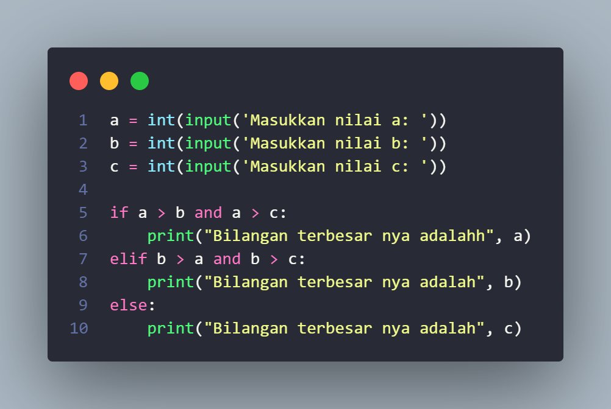
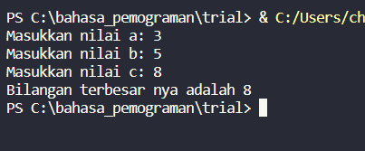
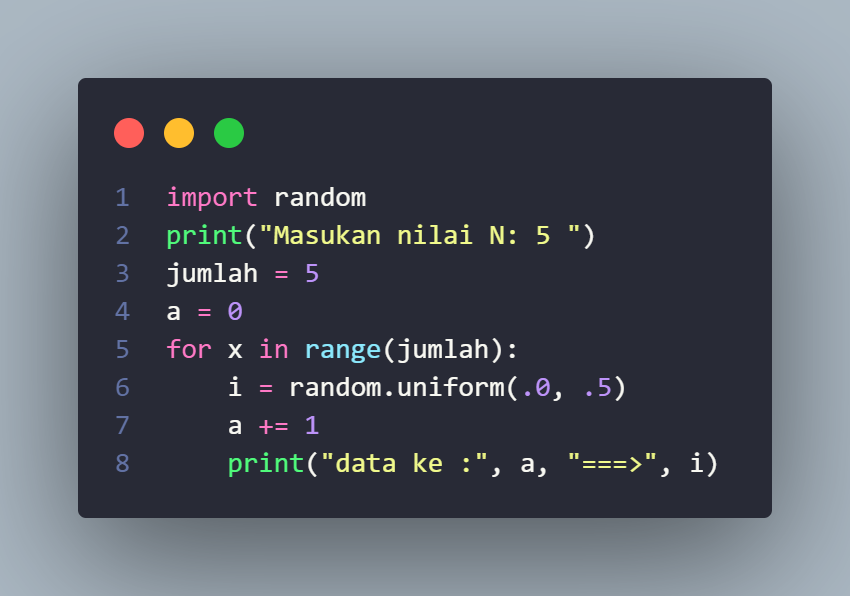
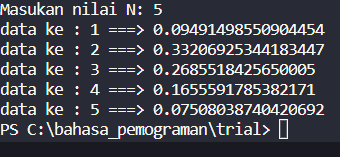

 **Tugas Pratikum 2**
 
**1. Labpspy 02**

1. deklasrasikan variable dengan meminta user menginputkan nilaia nya
2. dengan code seperti ini
3. a = int(input('Masukkan nilai a: ')) 
b = int(input('Masukkan nilai b: ')) 
c = int(input('Masukkan nilai c: '))
4. kita buat pengkondisian
5. jika a > b dan a > c tampilkan nilai a
6. jika b > a dan b > c tampilkan nilai b
7. jika c > a dan c > b tampilkan nilai c
 
# Ini contoh input nya

 
 
# dan ini output nya 

Itu adalah program mencari bilangan terbesar dari 3 bilangan yang di input

___________________________________________________________________________
_____________________________________________________________________________

### **Pratikum 3**

## **Latihan 1.py**

1. kita bikin variable dengan nama (jumlah) yang mempunyai nilai 5
2. kita bikin variable ke 2 dengan nama (a) yang mempunyai nilai 0
3. kita mencari nilai dengan menggunkan (FOR)
for x in range(jumlah):
    i = random.uniform(.0, .5)
    a += 1
4. cetak nilai data i
5. print("data ke :", a, "===>", i)
6. sehingga codingan nya seperti ini

    

## dan OUTPUT nya nilai Random

Itulah cara mencari nilai bilangan random
   

